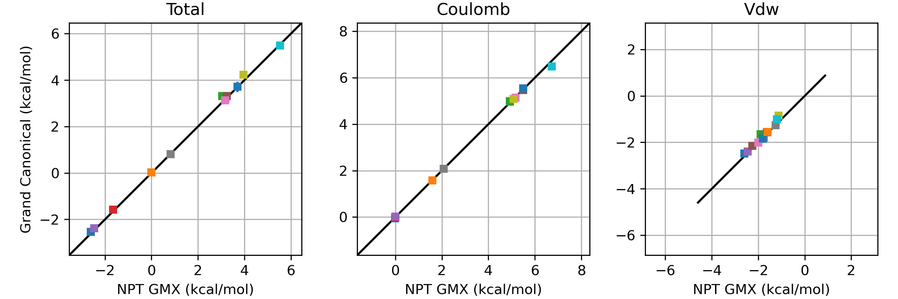

# 1. Installation
## 1.1 Install packages
```bash
# mamba works the same as conda.
mamba create -n grand_RE openmm openmmtools pymbar-core numpy mdanalysis openmpi=4.1.5 mpi4py cuda=12.3 parmed
# install specific openmpi/mpich on your cluster. 4.1.5 is only an example
# install specific cuda version according to `nvidia-smi`. 12.3 is only an example
mamba activate grand_RE
pip instal .
```
or use the `environment.yml` file. Change `cuda=12.3` according to the output of `nvidia-smi`.
```ymal
name: grand_RE
channels:
  - conda-forge
dependencies:
  - python=3.12
  - pip
  - numpy
  - openmm
  - openmmtools
  - pymbar-core
  - mdanalysis
  - openmpi=4.1.5
  - mpi4py
  - cuda=12.3
  - parmed
  - pip:
    - git+https://github.com/huichenggong/grand.git
```
```bash
mamba env create -f environment.yml
```

## 1.2 Add the kernel to jupyter notebook (optional)
```
mamba install ipykernel ipywidgets -y
python -m ipykernel install --user --name grand_RE
```

## 1.3 Later in the job script / on the cluster
```bash
source /home/NAME/SOFTWARE/miniforge3/bin/activate grand_RE
module add openmpi4/gcc/4.1.5 # example, be consistent with version inside the conda env
which mpirun # check if the correct mpirun is used
```

## 1.X Uninstall
```bash
jupyter kernelspec uninstall grand_RE  # remove the kernel named grand_RE from jupyter notebook
conda remove -n grand_RE --all # remove the conda environment named grand_RE
```

# Further development of GCMC
## 1.2.5 $\mu$ can be different for each replica.  
Math:  
Partition function, (replace $\beta \mu + ln(\frac{V^0}{V_{GCMC}})$ with $B$):  

$$
\begin{align*}
\pi(r_1, N_1, U_1, \mu_1 | \beta, V) * \pi(r_2, N_2, U_2, \mu_2 | \beta, V) ...
&=
\frac{1}{Z_1}
\frac{V^{N_1}}{{V_0}^{N_1} N_1!}
{exp \Big(-\beta \big(U_1(\textbf{r}_1) -\mu N_1 \big) \Big)}
...  \\
&=
\frac{1}{Z_1}
\frac{1}{N_1!}
{exp \Big(N_1 (\beta\mu_1+ln(\frac{V^0}{V}))-\beta U_1 (\textbf{r}_1) \Big)}
...  \\
&=
\frac{1}{Z_1}
\frac{1}{N_1!}
{exp \Big(N_1 B_1-\beta U_1(\textbf{r}_1) \Big)}
...  \\
\end{align*}
$$

Acceptance ratio:

$$
\begin{align*}
\frac{\pi_b}{\pi_a}
&=
\frac{
    \pi(r_2, N_2, U_1, \mu_1, r_1, N_1, U_2, \mu_2, ... | \beta, V)
}
{
    \pi(r_1, N_1, U_1, \mu_1, r_2, N_2, U_2, \mu_2, ... | \beta, V)
} \\
&= \frac
{exp(N_2 B_1 - \beta U_1(\textbf{r}_2))exp(N_1 B_2 - \beta U_2(\textbf{r}_1))}
{exp(N_1 B_1 - \beta U_1(\textbf{r}_1))exp(N_2 B_2 - \beta U_2(\textbf{r}_2))}
\end{align*}
$$

Reduced Energy Matrix:

$$
E_{ij} = N_i B_j - \beta U_j( \textbf{r}_i )
$$

## 1.2.1
`NonequilibriumGCMCSphereSamplerMultiState` is added for Hamiltonian replica exchange. 
The implementation is validated by solvation free energy. 
Same results are obtained as Gromacs NPT.  
  

The mathematical derivation is as follows.  

$$\pi
\left(
\begin{array}{c} 
\textbf{r}_1, N_1, U_1, \\
\textbf{r}_2, N_2, U_2, \\
\vdots \\
\end{array} \middle\lvert \beta,\mu
\right) = 
\frac{1}{Z_1}
\frac{V^{N_1}}{\Lambda^{3N_1} N_1!}
{exp \Big(-\beta \big(U_1(\textbf{r}_1) -\mu N_1 \big) \Big)}
...
$$

Acceptance ratio  
If all the replicas has the same temperature ($\beta$) and chemical potential ($\mu$), 
but different Hamiltonian ($U$). 

$$\frac{\pi_b}{\pi_a}
=\frac{\pi (\textbf{r}_2, N_2, U_1|\beta, \mu) \ \pi (\textbf{r}_1, N_1, U_2|\beta, \mu)}
      {\pi (\textbf{r}_1, N_1, U_1|\beta, \mu) \ \pi (\textbf{r}_2, N_2, U_2|\beta, \mu)}
=exp(-\beta \Delta U)
$$

## 1.1.1
Add support for Charmm force field.

# Forked from Essex Lab 
[](https://anaconda.org/essexlab/grand)
[](https://anaconda.org/essexlab/grand)
[](https://grand.readthedocs.io/en/latest/?badge=latest)
[](https://zenodo.org/badge/latestdoi/270705695)

# _grand_ : Grand Canonical Water Sampling in OpenMM

### Background

This Python module is designed to be run with OpenMM in order to simulate grand
canonical Monte Carlo (GCMC) insertion and deletion moves of water molecules.
This allows the particle number to vary according to a fixed chemical
potential, and offers enhanced sampling of water molecules in occluded
binding sites.
The theory behind our work on GCMC sampling can be found in the References
section below.

### Installation & Usage

This module can be installed from this directory by running the following
command:

```commandline
python setup.py install
```

The unit tests can then be carried out by running the following command from
this directory:
```commandline
python setup.py test
```

The dependencies of this module can be installed as:

```commandline
conda install -c conda-forge -c omnia openmmtools
pip install lxml
```
Many of grand's dependencies (openmm, mdtraj, pymbar, parmed) are also dependencies of 
openmmtools, and will be installed alongside openmmtools.

Alternatively, _grand_ and its dependencies can be installed via conda:
```commandline
conda install -c omnia -c anaconda -c conda-forge -c essexlab grand
```

Several (very short) examples of how this module is ran alongside OpenMM can be found in
the `examples/` directory.
Additional [examples](https://github.com/essex-lab/grand-paper) and 
[documentation](https://grand.readthedocs.io/en/latest/) are also available, although please note that the examples listed within the `grand-paper` repo are intended to be run using version 1.0.x of _grand_ and may not work with later versions.

### Citing _grand_

The _grand_ module is released under the MIT licence. If results from this
module contribute to a publication, we ask that you cite Refs. 1 and 2, below.
Ref. 1 discusses the initial implemention while ref. 2 discusses the implementation
and testing of the non-equilibrium moves.
Additional references describing the theory upon which the GCMC implemention
in _grand_ is based are also provided below (Refs. 3-4).

### Contributors

- Marley Samways `<mls2g13@soton.ac.uk>`
- Hannah Bruce Macdonald
- Ollie Melling `<ojm2g16@soton.ac.uk>`
- Will Poole `<wp1g16@soton.ac.uk>`

### Contact

If you have any problems or questions regarding this module, please contact
one of the contributors, or send an email to `<j.w.essex@soton.ac.uk>`.

### References

1. M. L. Samways, H. E. Bruce Macdonald, J. W. Essex, _J. Chem. Inf. Model._,
2020, 60, 4436-4441, DOI: https://doi.org/10.1021/acs.jcim.0c00648
2. O. J. Melling, M. L. Samways, Y. Ge, D. L. Mobley, J. W. Essex, _J. Chem. Theory Comput._, 2023,
DOI: https://doi.org/10.1021/acs.jctc.2c00823
3. G. A. Ross, M. S. Bodnarchuk, J. W. Essex, _J. Am. Chem. Soc._, 2015,
137, 47, 14930-14943, DOI: https://doi.org/10.1021/jacs.5b07940
4. G. A. Ross, H. E. Bruce Macdonald, C. Cave-Ayland, A. I. Cabedo
Martinez, J. W. Essex, _J. Chem. Theory Comput._, 2017, 13, 12, 6373-6381, DOI:
https://doi.org/10.1021/acs.jctc.7b00738
